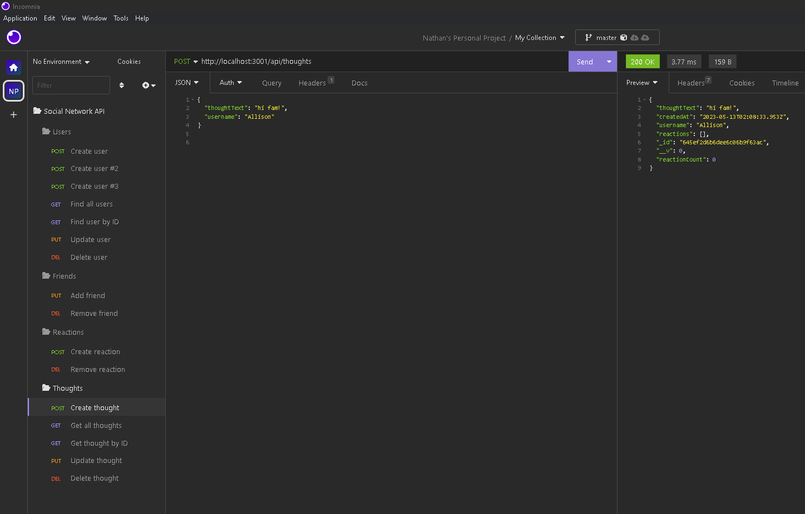
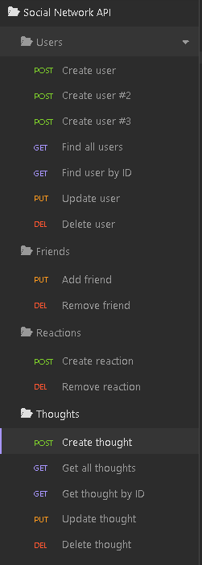

# Social-Network-API

## Description

The idea of this project is to build an API for a social network where users can share their thoughts and reactions with friends. This project is a great motivation and opportunity to practice building API using MongoDB. 

## Table of Contents

- [Installation](#installation)
- [Usage](#usage)
- [Credits](#credits)
- [License](#license)
- [Link](#link)

## Installation 

<li> Create a repository on Github and clone the files to a local location on your device 
<li> First, open Terminal and run command "npm i" to install all necessary packages for the application
<li> Once all packages are installed successfully, run command "nodemon" to start the application
<li> When completed all steps, "API server running on port 3001!" will be displayed in Terminal to indicate that the application is ready for testing in Insomnia

## Usage

## Link & Demo 

https://drive.google.com/file/d/1mm6UTyMIwxb_FDrYrW7a2Elbn-cAEcxk/view 

## Credits

Nathan- https://github.com/nathantr97  
Diego & Erik - AskBCS Assistants

## License

N/A

